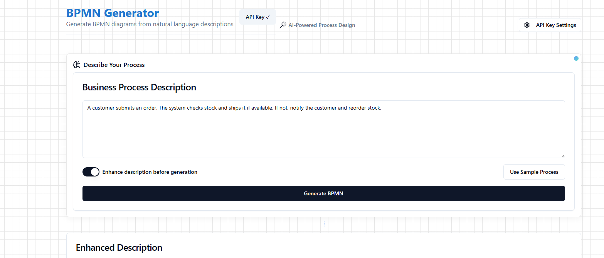

# 🔄 Process Model Weaver

> Transform your business process descriptions into beautiful BPMN diagrams with the power of AI! ✨

[](https://reactjs.org/)
[](https://www.typescriptlang.org/)
[](https://openai.com/)

## 📸 Screenshot


*The BPMN Generator interface showing the process description input and AI-powered enhancement options*

## 🌟 Features

- 🤖 **AI-Powered Process Analysis**: Transforms natural language descriptions into structured process models
- 📊 **BPMN 2.0 Visualization**: Interactive diagram viewer with zoom and pan capabilities
- 🔄 **Process Enhancement**: AI suggests improvements and missing steps in your process descriptions
- 💾 **Export Options**: Download your diagrams as BPMN or SVG files
- 🎨 **Modern UI**: Built with shadcn/ui and Tailwind CSS for a beautiful user experience
- 🔧 **XML Editor**: Built-in BPMN XML editor for manual adjustments

## 🚀 Quick Start

1. **Clone the repository**
   ```bash
   git clone <your-repo-url>
   cd process-model-weaver
   ```

2. **Install dependencies**
   ```bash
   npm install
   ```

3. **Set up your OpenAI API key**
   - Navigate to Settings in the app
   - Enter your OpenAI API key
   - The key is stored securely in your browser's local storage

4. **Start the development server**
   ```bash
   npm run dev
   ```

## 🎯 How to Use

1. **Describe Your Process**
   - Enter your business process description in natural language
   - Use the sample process button to see an example
   - Toggle "Enhance description" for AI-powered improvements

2. **Generate BPMN**
   - Click "Generate BPMN" to create your diagram
   - The AI will analyze and convert your description
   - View the enhanced description (if enabled)

3. **Interact with the Diagram**
   - Zoom in/out using the buttons or mouse wheel
   - Pan around by dragging
   - Download as BPMN or SVG

4. **Fine-tune (Optional)**
   - Use the XML editor to make manual adjustments
   - Changes are reflected in real-time

## 🌟 Sample Process

Try this example to get started:
```
A customer submits an order. The system checks stock and ships it if available. 
If not, notify the customer and reorder stock.
```

## 🛠️ Tech Stack

- **Frontend Framework**: React with TypeScript
- **Build Tool**: Vite
- **UI Components**: shadcn/ui
- **Styling**: Tailwind CSS
- **BPMN Rendering**: bpmn-js
- **AI Integration**: OpenAI API
- **State Management**: React Hooks

## 📦 Project Structure

```
process-model-weaver/
├── src/
│   ├── components/     # React components
│   ├── hooks/         # Custom React hooks
│   ├── lib/           # Utility functions
│   ├── pages/         # Page components
│   └── services/      # API and service integrations
├── public/            # Static assets
└── ...configuration files
```

## 🤝 Contributing

Contributions are welcome! Feel free to:
- 🐛 Report bugs
- 💡 Suggest features
- 🔧 Submit pull requests

## 📄 License

This project is licensed under the MIT License - see the [LICENSE](LICENSE) file for details.

## 🙏 Acknowledgments

- Built with [bpmn-js](https://github.com/bpmn-io/bpmn-js) by Camunda
- UI components from [shadcn/ui](https://ui.shadcn.com/)
- Powered by [OpenAI](https://openai.com/)

---

<p align="center">Made with ❤️ for process modeling enthusiasts</p> 